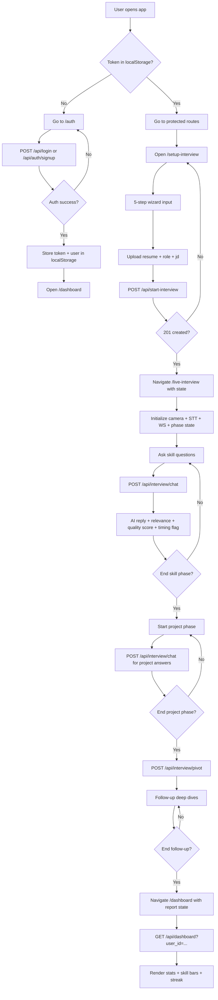
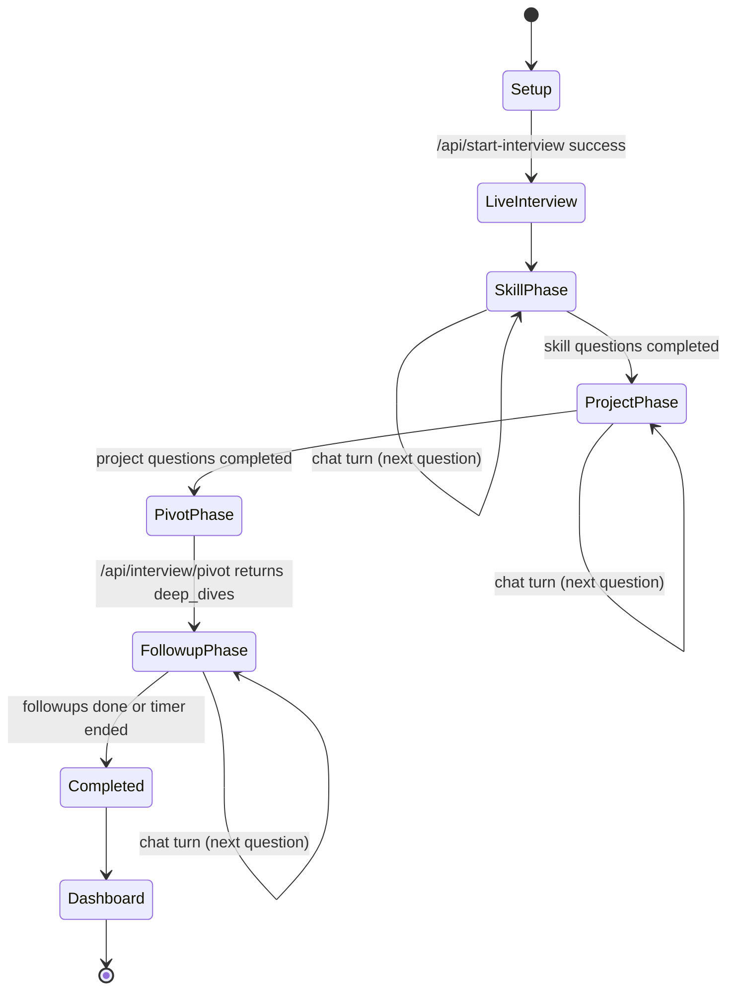

# AI Virtual Interview Coach — System Deep Dive

---

## 1. PROJECT OVERVIEW

AI Virtual Interview Coach is a full-stack interview preparation and simulation platform that combines a React (Vite) frontend with a FastAPI backend, integrating LLM-driven question generation, resume-grounded RAG context, live interview conversational flows, practice modules (mock test + English fluency), and administrative observability. The system is designed as a practical interview-readiness environment where a candidate can sign up, upload a resume, enter a structured interview simulation, receive AI feedback and scoring signals, and review progression through a dashboard while backend services persist state, apply auth/rate-limiting controls, and orchestrate retrieval + LLM pipelines.

- Primary users:
  - Students preparing for placements and internships
  - Job seekers preparing for technical and behavioral interviews
  - Placement officers / program coordinators (admin view)
- Core problem solved:
  - Makes interview preparation structured, repeatable, and personalized by grounding interview prompts in resume/JD context and tracking progression over time with persistent metrics.

| Layer | Technology | Why Used |
|---|---|---|
| Frontend | React 19 + Vite + React Router + Tailwind styles | Fast SPA development, route-based UX, modern component model |
| Backend API | FastAPI + Pydantic + Uvicorn | Typed, async-friendly HTTP API with automatic validation/docs |
| ORM / Persistence | SQLAlchemy + Alembic | Relational modeling, migration-controlled schema evolution |
| Database | PostgreSQL (Docker) / SQLite fallback | Postgres for deployment reliability, SQLite for local/test convenience |
| Auth | JWT (access) + hashed refresh tokens + Argon2/bcrypt verify | Secure session model with rotation support and backward compatibility |
| AI/LLM Orchestration | LiteLLM + LangChain components | Provider fallback + chain/tool abstractions |
| Embeddings | sentence-transformers/all-MiniLM-L6-v2 | Local CPU embeddings for resume retrieval |
| Vector Store | ChromaDB | Persistent semantic retrieval over resume chunks |
| RAG Pipeline | LangChain loaders/splitters + Chroma upsert/retrieve | Resume-conditioned response grounding |
| Real-time | Browser Web Speech APIs + FastAPI WebSocket endpoint | Voice interaction + bidirectional low-latency channel |
| Rate Limiting | SlowAPI deps + in-memory request buckets | Protects auth/chat/pivot/quiz endpoints from abuse bursts |
| Caching | In-memory + DB-backed cache_entries + optional Redis | LLM response reuse and latency/cost reduction |
| Deep Learning Add-ons | sentence-transformers, transformers cross-encoder, librosa | Relevance/quality scoring and audio feature extraction |

---

## 2. COMPLETE FEATURE LIST

### 1) User Signup / Login / JWT Auth
- What it does:
  - Supports account creation, login, JWT access token issuance, and refresh token rotation. Legacy login endpoint also exists for frontend compatibility.
- Files:
  - Backend: `backend/routes/auth.py`, `backend/core/security.py`, `backend/auth/security.py`, `backend/models.py`
  - Frontend: `frontend/src/pages/Auth.jsx`, `frontend/src/services/api.js`, `frontend/src/App.jsx`
- Endpoints:
  - `POST /api/auth/signup`, `POST /api/auth/login`, `POST /api/auth/refresh`, `GET /api/auth/me`, `POST /api/login`
- Current status: ✅ Working
- Why it matters:
  - Required to gate protected interview and dashboard routes.

### 2) Resume Upload & PDF Parsing
- What it does:
  - Candidate uploads PDF resume during setup; backend validates file and extracts a lightweight resume brief.
- Files:
  - Frontend: `frontend/src/pages/InterviewSetup.jsx`
  - Backend: `backend/routes/interview.py`, `backend/services/rag_service.py`
- Endpoints:
  - `POST /api/start-interview`
- Current status: ✅ Working
- Why it matters:
  - Seeds interview personalization and RAG context.

### 3) RAG (Resume Embedding into Vector DB)
- What it does:
  - Queues embedding tasks, chunks focused resume sections, writes vectors to Chroma per user, tracks status.
- Files:
  - Backend: `backend/services/rag_service.py`, `backend/rag/store.py`, `backend/models.py`
- Endpoints:
  - `GET /api/interview/rag-status`
- Current status: ⚠️ Partially Working
- Why it matters:
  - Enables context-aware follow-up based on candidate background.

### 4) Interview Setup (5-step wizard)
- What it does:
  - Collects candidate info, role, intensity, JD, resume, and hardware permission checks before simulation start.
- Files:
  - Frontend: `frontend/src/pages/InterviewSetup.jsx`
- Endpoints:
  - `POST /api/start-interview`
- Current status: ✅ Working
- Why it matters:
  - Prevents low-context or incomplete interview sessions.

### 5) Live Interview (skill + project + followup phases)
- What it does:
  - Executes phased interview loop with state transitions and final report handoff to dashboard.
- Files:
  - Frontend: `frontend/src/pages/LiveInterview.jsx`
  - Backend: `backend/routes/interview.py`, `backend/services/interview_service.py`
- Endpoints:
  - `POST /api/interview/chat`, `POST /api/interview/pivot`, `GET /api/interview/{session_id}/history`
- Current status: ⚠️ Partially Working
- Why it matters:
  - Core user-facing interview simulation engine.

### 6) AI Question Generation (Gemini via LiteLLM)
- What it does:
  - Uses fallback model routing with strict JSON schemas to generate interview plans, pivots, quizzes, reports.
- Files:
  - Backend: `backend/services/llm_service.py`, `backend/llm/router.py`
- Endpoints:
  - Consumed by multiple route handlers (`/api/start-interview`, `/api/interview/pivot`, `/api/generate-quiz`, `/api/english/questions`, `/api/english/report`)
- Current status: ✅ Working
- Why it matters:
  - Produces dynamic, adaptive, non-static interview content.

### 7) Real-time TTS (Text-to-Speech)
- What it does:
  - Uses browser speech synthesis to read interviewer prompts and feedback.
- Files:
  - Frontend: `frontend/src/pages/LiveInterview.jsx`, `frontend/src/pages/EnglishPractice.jsx`
- Endpoints:
  - N/A (browser API)
- Current status: ✅ Working
- Why it matters:
  - Improves interview realism and spoken interaction.

### 8) Speech-to-Text (browser Web Speech API)
- What it does:
  - Captures candidate voice input and maps transcript into chat input state.
- Files:
  - Frontend: `frontend/src/pages/LiveInterview.jsx`, `frontend/src/pages/EnglishPractice.jsx`
- Endpoints:
  - N/A (browser API)
- Current status: ⚠️ Partially Working
- Why it matters:
  - Enables hands-free answer submission.

### 9) Agent-based interview flow (LangChain AgentExecutor)
- What it does:
  - Provides agent session manager with tools (resume search, scorer, feedback generator), memory, and fallback model invocation.
- Files:
  - Backend: `backend/agent/session.py`, `backend/agent/tools.py`, `backend/agent/policy.py`
- Endpoints:
  - Not currently wired as primary path in `routes/interview.py`
- Current status: 🔧 In Progress
- Why it matters:
  - Intended for richer tool-augmented conversational coaching.

### 10) Interview Pivot logic (8+5 dynamic followup)
- What it does:
  - After phase completion, backend generates deep-dive follow-up probes from history.
- Files:
  - Frontend: `frontend/src/pages/LiveInterview.jsx`
  - Backend: `backend/routes/interview.py`, `backend/services/llm_service.py`
- Endpoints:
  - `POST /api/interview/pivot`
- Current status: ✅ Working
- Why it matters:
  - Converts generic interview into adaptive depth testing.

### 11) Performance Scoring (readiness score)
- What it does:
  - Chat endpoint returns readiness score; dashboard updates readiness/interview counters.
- Files:
  - Backend: `backend/services/llm_service.py`, `backend/routes/interview.py`, `backend/routes/user.py`
  - Frontend: `frontend/src/pages/Dashboard.jsx`
- Endpoints:
  - `POST /api/interview/chat`, `POST /api/user/update-stats/{user_id}`, `GET /api/dashboard`
- Current status: ✅ Working
- Why it matters:
  - Gives measurable progression and session feedback.

### 12) Mock Test (MCQ with timer)
- What it does:
  - Generates category quiz, tracks answer map and timer, submits outcome to user stats.
- Files:
  - Frontend: `frontend/src/pages/MockTest.jsx`
  - Backend: `backend/routes/mock.py`, `backend/services/mock_service.py`, `backend/services/llm_service.py`
- Endpoints:
  - `POST /api/generate-quiz`, `POST /api/user/update-stats/{user_id}`
- Current status: ⚠️ Partially Working
- Why it matters:
  - Adds objective practice mode beyond interview dialog.

### 13) English Practice (fluency simulation)
- What it does:
  - Topic fetch, prep timer, Q&A rounds, final report generation.
- Files:
  - Frontend: `frontend/src/pages/EnglishPractice.jsx`
  - Backend: `backend/routes/mock.py`, `backend/services/llm_service.py`
- Endpoints:
  - `GET /api/english/topic`, `POST /api/english/questions`, `POST /api/english/report`
- Current status: ✅ Working
- Why it matters:
  - Trains communication and fluency for interviews.

### 14) Dashboard (stats, skill bars, streak)
- What it does:
  - Fetches backend stats and overlays local derived stats from session outcomes.
- Files:
  - Frontend: `frontend/src/pages/Dashboard.jsx`, `frontend/src/components/SkillBars.jsx`, `frontend/src/components/StatCard.jsx`
  - Backend: `backend/routes/user.py`
- Endpoints:
  - `GET /api/dashboard`
- Current status: ⚠️ Partially Working
- Why it matters:
  - Persistent user motivation and performance visibility.

### 15) Deep Learning — Answer Relevance Verifier
- What it does:
  - Computes semantic question-answer alignment and verdict categories.
- Files:
  - Backend: `backend/services/answer_verifier.py`, `backend/routes/interview.py`
- Endpoints:
  - `POST /api/interview/chat` (embedded in response field `relevance`)
- Current status: ✅ Working
- Why it matters:
  - Detects off-topic answers early in interview loop.

### 16) Deep Learning — Answer Quality Scorer
- What it does:
  - Uses cross-encoder text classification score for answer quality.
- Files:
  - Backend: `backend/services/scoring_service.py`, `backend/routes/interview.py`
- Endpoints:
  - `POST /api/interview/chat` (response field `quality_score`)
- Current status: ✅ Working
- Why it matters:
  - Adds an ML-derived quality signal beyond generic LLM response text.

### 17) Student Proctoring (tab switch, timing)
- What it does:
  - Logs tab blur/hidden events and flags suspiciously fast answers.
- Files:
  - Frontend: `frontend/src/pages/LiveInterview.jsx`
  - Backend: `backend/routes/proctor.py`, `backend/routes/interview.py`
- Endpoints:
  - `POST /api/proctor/log`, `GET /api/proctor/report/{session_id}`, `POST /api/interview/chat`
- Current status: ✅ Working
- Why it matters:
  - Supports integrity checks for interview simulation authenticity.

### 18) WebSocket real-time feedback
- What it does:
  - Connects live interview page to backend websocket and appends realtime messages.
- Files:
  - Frontend: `frontend/src/pages/LiveInterview.jsx`
  - Backend: `backend/main.py`
- Endpoints:
  - `GET ws://.../ws/interview/{session_id}`
- Current status: ⚠️ Partially Working
- Why it matters:
  - Enables future low-latency assistant feedback stream.

### 19) Admin Dashboard
- What it does:
  - Admin login and management views for users and aggregate platform stats.
- Files:
  - Frontend: `frontend/src/pages/AdminLogin.jsx`, `frontend/src/pages/AdminDashboard.jsx`
  - Backend: `backend/routes/admin.py`
- Endpoints:
  - `POST /api/admin/login`, `GET /api/admin/stats`, `GET /api/admin/users`, `GET /api/admin/users/{user_id}`
- Current status: ✅ Working
- Why it matters:
  - Provides operational oversight across user base.

### 20) Rate limiting (SlowAPI + local limiter)
- What it does:
  - Limits sensitive endpoints and in-code request windows for chat/pivot/quiz.
- Files:
  - Backend: `backend/core/rate_limit.py`, route handlers invoking `enforce_rate_limit`
- Endpoints:
  - `POST /api/interview/chat`, `POST /api/interview/pivot`, `POST /api/generate-quiz`
- Current status: ✅ Working
- Why it matters:
  - Prevents abuse and protects provider cost/latency.

### 21) Refresh token rotation
- What it does:
  - Rotates refresh token, stores hash, revokes old token chain.
- Files:
  - Backend: `backend/routes/auth.py`, `backend/core/security.py`, `backend/auth/security.py`, `backend/models.py`
- Endpoints:
  - `POST /api/auth/refresh`
- Current status: ✅ Working
- Why it matters:
  - Reduces replay risk and hardens auth lifecycle.

### 22) Global cache (DB-backed)
- What it does:
  - LLM outputs cached in memory + DB cache entries with expiration, optional Redis layer.
- Files:
  - Backend: `backend/services/llm_service.py`, `backend/models.py`, Alembic migration `0003_cache_entries`
- Endpoints:
  - Used transitively by interview/pivot/quiz/report generation endpoints
- Current status: ✅ Working
- Why it matters:
  - Improves response speed and lowers repetitive LLM cost.

---

## 3. SYSTEM ARCHITECTURE DIAGRAM (ASCII + Mermaid)

### 3A. High-Level Architecture (ASCII art)

```
                           +----------------------------------+
                           |         User Browser             |
                           |  (React SPA, Web Speech, WS)    |
                           +----------------+-----------------+
                                            |
                                            | HTTPS / WS
                                            v
               +-------------------------------------------------------------+
               |                React Frontend (Vite)                        |
               |  Routes: auth/setup/live/mock/english/dashboard/admin       |
               |  Components: ErrorBoundary, SkillBars, StatCard, etc.       |
               +-------------------------------+-----------------------------+
                                               |
                                               | REST API + WebSocket
                                               v
 +---------------------------------------------------------------------------------------+
 |                                  FastAPI Backend                                      |
 |---------------------------------------------------------------------------------------|
 | Routers: auth, interview, mock/english, user, admin, proctor                         |
 | Services: llm_service, rag_service, mock_service, interview_service, DL modules       |
 | Controls: JWT auth, refresh rotation, rate limit, validation, exception handlers      |
 +---------------------------+---------------------------------------+-------------------+
                             |                                       |
                             | LLM calls via LiteLLM                 | SQLAlchemy ORM
                             v                                       v
         +-----------------------------------+       +-----------------------------------+
         |        Gemini API / Providers     |       |        PostgreSQL / SQLite        |
         |  (fallback routing in llm/router) |       | users/interviews/mocks/sessions   |
         +------------------+----------------+       +------------------+----------------+
                            |                                       |
                            | optional agent/tool architecture      | metadata + status
                            v                                       v
          +-------------------------------------+    +------------------------------------+
          | LangChain AgentExecutor + Tools     |    | ChromaDB Vector Store              |
          | ResumeSearch, Scorer, FeedbackTool  |    | per-user resume embedding index    |
          +------------------+------------------+    +------------------+-----------------+
                             \                                   /
                              \------ Embeddings + Retrieval ----/
```

### 3B. Request Flow Diagram (Mermaid)



### 3C. Database Schema Diagram (ASCII)

```
+------------------------+
| users                  |
|------------------------|
| id PK                  |
| name                   |
| email UNIQUE           |
| password               |
| target_role            |
| readiness_score        |
| streak_count           |
| total_interviews       |
| total_mocks            |
| total_english_sessions |
| last_login             |
| created_at             |
+-----------+------------+
            |
            | 1-to-many
            +--------------------+
            |                    |
            v                    v
+---------------------+     +---------------------+
| interviews          |     | refresh_tokens      |
|---------------------|     |---------------------|
| id PK               |     | id PK               |
| user_id FK->users   |     | user_id FK->users   |
| session_id UNIQUE   |     | token_hash UNIQUE   |
| role                |     | revoked             |
| candidate_name      |     | created_at          |
| status              |     | expires_at          |
| current_question    |     | revoked_at          |
| resume_context      |     +---------------------+
| transcript JSON/JSONB|
| overall_score       |
| brutal_feedback     |
| had_pivot           |
| created_at          |
+---------------------+

+---------------------+      +---------------------+      +---------------------+
| mock_tests          |      | english_sessions    |      | attendance          |
|---------------------|      |---------------------|      |---------------------|
| id PK               |      | id PK               |      | id PK               |
| user_id FK->users   |      | user_id FK->users   |      | user_id FK->users   |
| category            |      | topic               |      | date                |
| score               |      | grammar_score       |      +---------------------+
| total_questions     |      | vocab_score         |
| created_at          |      | fluency_score       |
+---------------------+      | rating              |
                             | critique            |
                             | created_at          |
                             +---------------------+

+---------------------+      +---------------------+      +---------------------+
| global_mocks        |      | rag_status          |      | cache_entries       |
|---------------------|      |---------------------|      |---------------------|
| id PK               |      | id PK               |      | id PK               |
| questions JSON      |      | user_id FK->users   |      | key UNIQUE          |
| created_at          |      | status              |      | value_json          |
+---------------------+      | message             |      | expires_at          |
                             | chunks              |      | created_at          |
                             | updated_at          |      +---------------------+
                             +---------------------+
```

### 3D. Interview State Machine (Mermaid)



---

## 4. API ENDPOINTS REFERENCE

| Method | Endpoint | Auth Required | Request Body | Response | Used By |
|---|---|---|---|---|---|
| POST | `/api/login` | No | `email,password` | user + access/refresh/token fields | `Auth.jsx`, `api.js` |
| POST | `/api/auth/signup` | No | `email,password,name` | `{id,email,name}` | `Auth.jsx` |
| POST | `/api/auth/login` | No | `email,password` | token pair object | Backend tests / alt clients |
| POST | `/api/auth/refresh` | No (refresh token body) | `refresh_token` | rotated token pair | Token lifecycle |
| GET | `/api/auth/me` | Yes | n/a | user profile | Protected client verification |
| POST | `/api/start-interview` | Yes | multipart `resume,name,jd,role` | intro + question sets + session_id | `InterviewSetup.jsx` |
| POST | `/api/interview/chat` | Yes | `answer,question,context,session_id,time_taken_seconds` | reply + readiness + quality/relevance/timing | `LiveInterview.jsx` |
| POST | `/api/interview/pivot` | Yes | `history,context,role,session_id` | analysis + deep_dives | `LiveInterview.jsx` |
| GET | `/api/interview/{session_id}/history` | Yes | n/a | transcript array | Future replay/history |
| GET | `/api/interview/rag-status` | Yes | n/a | status/message/chunks | RAG status indicator |
| POST | `/api/interview/analyze-audio` | No (current impl) | multipart audio file | MFCC/energy/tempo/confidence | Audio analysis features |
| POST | `/api/generate-quiz` | Yes | `category,force_new` | quiz question list | `MockTest.jsx` |
| GET | `/api/english/topic` | Yes | n/a | topic string | `EnglishPractice.jsx` |
| POST | `/api/english/questions` | Yes | `topic` | generated questions | `EnglishPractice.jsx` |
| POST | `/api/english/report` | Yes | history list | report object | `EnglishPractice.jsx` |
| GET | `/api/user/stats/{user_id}` | No explicit token guard | n/a | readiness/interviews/mocks/streak/email | Optional |
| GET | `/api/dashboard` | Yes | query `user_id` | dashboard object | `Dashboard.jsx` |
| POST | `/api/user/update-stats/{user_id}` | Yes | `score,type` | `{status:"ok"}` | `MockTest.jsx`, interview completion paths |
| POST | `/api/admin/login` | No | `email,password` | `admin_token` | `AdminLogin.jsx` |
| POST | `/admin/login` | No | same as above | `admin_token` | alias route |
| GET | `/api/admin/stats` | Admin bearer | n/a | aggregate counts | `AdminDashboard.jsx` |
| GET | `/api/admin/users` | Admin bearer | query `limit,offset` | user list | `AdminDashboard.jsx` |
| GET | `/api/admin/users/{user_id}` | Admin bearer | n/a | user + activity details | `AdminDashboard.jsx` |
| POST | `/api/proctor/log` | No explicit token guard | `session_id,event_type,timestamp,metadata?` | log count | `LiveInterview.jsx` |
| GET | `/api/proctor/report/{session_id}` | No explicit token guard | n/a | event list + integrity summary | proctor review |
| GET | `/` | No | n/a | health/message | availability check |
| WS | `/ws/interview/{session_id}` | No explicit auth | text frames | echo text frames | `LiveInterview.jsx` realtime channel |

---

## 5. FRONTEND PAGES & COMPONENTS

### Home (`frontend/src/pages/Home.jsx`)
- Route: `/`
- Renders:
  - Landing hero, modules grid, mission copy, and CTA navigation.
- State:
  - `user: object|null` (safe localStorage parse)
  - `isLoggedIn: boolean`
- Key functions:
  - `FeatureCard` navigation logic
- API calls:
  - None
- Props:
  - `FeatureCard` receives module metadata
- Known issues:
  - Access badge assumes `user.email` exists when logged in.

### Auth (`frontend/src/pages/Auth.jsx`)
- Route: `/auth`
- Renders:
  - Login/signup card with email/password form and mode toggle.
- State:
  - `isLogin:boolean`, `email:string`, `password:string`
- Key functions:
  - `handleSubmit()`: calls signup/login endpoints
- API calls:
  - `POST /api/login` or `POST /api/auth/signup`
- Known issues:
  - Uses alerts for error UX and assumes signup always followed by manual login.

### InterviewSetup (`frontend/src/pages/InterviewSetup.jsx`)
- Route: `/setup-interview`
- Renders:
  - 5-step setup wizard (candidate/role, intensity, JD, resume, hardware check).
- State:
  - `step:number`, `loading:boolean`, `hardwareGranted:{cam,mic}`, `data` object fields
- Key functions:
  - `checkPermissions()`, `finalizeSetup()`
- API calls:
  - `POST /api/start-interview`
- Known issues:
  - Hard dependency on browser media device permissions.

### LiveInterview (`frontend/src/pages/LiveInterview.jsx`)
- Route: `/live-interview`
- Renders:
  - Split-screen interview HUD + intelligence feed + voice/text response controls.
- State:
  - Interview arrays (`questions`, `skillQuestions`, `projectQuestions`)
  - Progress (`currentIndex`, `phase`, `timeLeft`, `startCountdown`)
  - Voice (`isListening`, `isAiSpeaking`, `userInput`)
  - Messaging (`messages`, `performanceLog`)
- Key functions:
  - `speak()`, `askQuestion()`, `toggleListening()`, `handleSend()`, `finishInterview()`, `logProctorEvent()`
- API calls:
  - `POST /api/interview/chat`
  - `POST /api/interview/pivot`
  - `POST /api/proctor/log`
  - WebSocket `/ws/interview/{session_id}`
- Known issues:
  - Guard redirects if route state missing (works but still tightly coupled to navigation-state entry).

### Dashboard (`frontend/src/pages/Dashboard.jsx`)
- Route: `/dashboard`
- Renders:
  - Sidebar, readiness progress, stat cards, skill bars, milestone card.
- State:
  - `stats:object`, `loading:boolean`, `error:string|null`
- Key functions:
  - `getUserId()`, `fetchDashboard()`, `userEmail()`
- API calls:
  - `GET /api/dashboard?user_id=...`
- Known issues:
  - Uses dynamic Tailwind class strings (`bg-${color}`) in subcomponents that may be purged in production builds.

### MockTest (`frontend/src/pages/MockTest.jsx`)
- Route: `/mock`
- Renders:
  - Category selection then MCQ exam interface with timer and question matrix.
- State:
  - `testState`, `category`, `questions`, `currentIndex`, `userAnswers`, `status`, `timeLeft`, `loading`, `cacheHit`
- Key functions:
  - `startTest()`, `submitTest()`, `handleAnswer()`, `toggleReview()`, `calculateScore()`
- API calls:
  - `POST /api/generate-quiz`
  - `POST /api/user/update-stats/{user_id}`
- Known issues:
  - No explicit handling when backend returns empty/invalid question payload beyond alert.

### EnglishPractice (`frontend/src/pages/EnglishPractice.jsx`)
- Route: `/english`
- Renders:
  - Topic reveal, prep timer, conversation simulation, final report view.
- State:
  - `step`, `topic`, `questions`, `currentIndex`, `phase`, `timer`, `messages`, `userInput`, `isListening`, `isAiSpeaking`, `loading`, `report`
- Key functions:
  - `initializeSimulation()`, `toggleListening()`, `handleSend()`, `speak()`
- API calls:
  - `GET /api/english/topic`
  - `POST /api/english/questions`
  - `POST /api/english/report`
- Known issues:
  - `phase` is declared but not fully transitioned into deep-dive flow in current logic.

### AdminLogin (`frontend/src/pages/AdminLogin.jsx`)
- Route: `/admin/login`
- Renders:
  - Admin credential form and error state.
- State:
  - `email`, `password`, `error`, `loading`
- Key functions:
  - `onSubmit()`
- API calls:
  - `POST /api/admin/login`
- Known issues:
  - Generic invalid credential messaging; no lockout/backoff.

### AdminDashboard (`frontend/src/pages/AdminDashboard.jsx`)
- Route: `/admin`
- Renders:
  - Platform stats cards, paginated user table, detailed user activity panel.
- State:
  - `stats`, `users`, `selected`, `detail`, `loading`, `page`
- Key functions:
  - `logout()`, `viewDetails()`
- API calls:
  - `GET /api/admin/stats`
  - `GET /api/admin/users`
  - `GET /api/admin/users/{user_id}`
- Known issues:
  - Relies solely on localStorage admin token without route guard middleware.

### Evaluation (`frontend/src/pages/Evaluation.jsx`)
- Route:
  - Not wired in `App.jsx`
- Renders:
  - Standalone evaluation report card UI with mock fallback data.
- State:
  - `report` prop fallback only
- Key functions:
  - None complex; navigation via `window.location.href`
- API calls:
  - None
- Known issues:
  - Unused route/component and contains placeholder mock data.

### ErrorBoundary (`frontend/src/components/ErrorBoundary.jsx`)
- Route:
  - Global wrapper in `main.jsx`
- Renders:
  - Full-screen crash fallback with return-home action.
- State:
  - `hasError`, `error`
- Key functions:
  - `getDerivedStateFromError`, `componentDidCatch`
- API calls:
  - None
- Known issues:
  - Reload action uses hard redirect.

### ErrorState (`frontend/src/components/ErrorState.jsx`)
- Route:
  - Embedded in dashboard
- Renders:
  - Error card with optional retry callback.
- State:
  - props only
- Key functions:
  - none
- API calls:
  - none
- Known issues:
  - Text currently backend-port specific.

### LoadingSpinner (`frontend/src/components/LoadingSpinner.jsx`)
- Renders:
  - Generic spinner + label.
- State:
  - props only
- Known issues:
  - none significant.

### SkillBars (`frontend/src/components/SkillBars.jsx`)
- Renders:
  - Skill matrix bars with clamp and fallback state.
- State:
  - props only
- Known issues:
  - none significant.

### StatCard (`frontend/src/components/StatCard.jsx`)
- Renders:
  - Premium stat card style by tone mapping.
- State:
  - props only
- Known issues:
  - none significant.

---

## 6. DEEP LEARNING MODULES

### 6.1 Answer Relevance Verifier
- File:
  - `backend/services/answer_verifier.py`
- Model:
  - `sentence-transformers/all-MiniLM-L6-v2` (semantic embedding encoder)
- Input -> Output:
  - Input: `question:str`, `answer:str`
  - Output: `{is_relevant, score, verdict, feedback_hint}`
- Wiring:
  - Called inside `POST /api/interview/chat` in `backend/routes/interview.py`
- Performance:
  - CPU inference, usually low-latency for short text (<200 ms typical local CPU, variable)
- Limitations:
  - Threshold heuristic can misclassify nuanced but indirectly related answers.

### 6.2 Answer Quality Scorer
- File:
  - `backend/services/scoring_service.py`
- Model:
  - cross-encoder `ms-marco-MiniLM-L-6-v2` via transformers pipeline
- Input -> Output:
  - Input: `question`, `answer`
  - Output: `quality_score: float`
- Wiring:
  - Called in `backend/routes/interview.py` chat route
- Performance:
  - Heavier than embedding cosine; first-call cold start can be substantial
- Limitations:
  - Score calibrated for retrieval relevance, not full pedagogical quality.

### 6.3 Speech Confidence Analyzer
- File:
  - `backend/services/audio_features.py`
- Model/Library:
  - `librosa` DSP features (MFCC, ZCR, energy, tempo); no neural model
- Input -> Output:
  - Input: uploaded audio file path
  - Output: feature vector + confidence estimate heuristic
- Wiring:
  - Exposed at `POST /api/interview/analyze-audio`
- Performance:
  - Depends on audio length; short clips are fast, long clips proportionally slower
- Limitations:
  - Heuristic confidence is coarse and language/accent-agnostic.

### 6.4 Resume RAG Pipeline
- Files:
  - `backend/services/rag_service.py`, `backend/rag/store.py`
- Model:
  - `sentence-transformers/all-MiniLM-L6-v2` embeddings
- Input -> Output:
  - Input: PDF bytes + user id
  - Output: per-user vector index + rag_status state (`processing/ready/failed`)
- Wiring:
  - Triggered from `POST /api/start-interview`
- Performance:
  - Async worker queue + retries; throughput bound by CPU embedding speed and PDF complexity
- Limitations:
  - Section extraction is heuristic and may miss context in poorly formatted resumes.

### 6.5 LangChain Agent + Tools
- Files:
  - `backend/agent/session.py`, `backend/agent/tools.py`, `backend/agent/policy.py`
- Model:
  - ChatLiteLLM with fallback model candidates
- Input -> Output:
  - Input: ongoing conversational turns + tool context
  - Output: tool-augmented response
- Wiring:
  - Session manager exists but current main interview route is direct llm_service flow
- Performance:
  - Adds overhead for memory/tool orchestration
- Limitations:
  - Not fully integrated into primary API path yet.

---

## 7. KNOWN BUGS & CURRENT PROBLEMS

| # | Severity | File | Line | Problem | Root Cause | Status |
|---|---|---|---|---|---|---|
| 1 | 🔵 Medium | `frontend/src/pages/Home.jsx` | ~79 | `user.email.split` can throw if malformed stored object | No optional chaining on nested user access | ⚠️ Open |
| 2 | 🟡 High | `frontend/src/pages/EnglishPractice.jsx` | 24-29 | `phase` state mostly unused for deep-dive transition | Incomplete logic branch for phase progression | ⚠️ Open |
| 3 | 🔵 Medium | `frontend/src/pages/Evaluation.jsx` | full file | Unrouted placeholder page | Route not registered in `App.jsx` | ⚠️ Open |
| 4 | 🟡 High | `frontend/src/pages/Dashboard.jsx` | 240+ | Dynamic Tailwind class interpolation may fail production purge | Tailwind cannot statically see generated class names | ⚠️ Open |
| 5 | 🔴 Critical | `backend/routes/proctor.py` | 15-54 | Proctor endpoints unauthenticated | Missing `Depends(get_current_user)` authorization guard | ⚠️ Open |
| 6 | 🔴 Critical | `backend/main.py` + ws client | ws endpoint | WebSocket channel unauthenticated and echo-only | No token/session validation; no server-side tip generation pipeline | ⚠️ Open |
| 7 | 🟡 High | `backend/routes/interview.py` | 175+ | Audio analysis endpoint has no auth | Current route signature removed auth dependency | ⚠️ Open |
| 8 | 🔵 Medium | `backend/services/audio_features.py` | 19-21 | estimated WPM formula not based on speech segmentation | Uses sample length heuristic only | ⚠️ Open |
| 9 | 🟡 High | `frontend/src/pages/LiveInterview.jsx` | 25-28 | Hard redirect on missing route state, no recovery fetch | Session bootstrap depends on navigation state only | ⚠️ Open |
| 10 | 🟡 High | `frontend/src/pages/Auth.jsx` | 15 | Uses legacy login endpoint by default | Inconsistent use of `/api/login` vs `/api/auth/login` | ⚠️ Open |
| 11 | 🔵 Medium | `frontend/src/pages/MockTest.jsx` | 44 | Generic fallback alert still vague for non-HTTP errors | Minimal error taxonomy in UI | ⚠️ Open |
| 12 | 🔵 Medium | `backend/services/llm_service.py` | cache keys | Cache keys built from truncated text may collide | simplistic key strategy for long content | ⚠️ Open |
| 13 | 🟡 High | `backend/services/scoring_service.py` | model init | Heavy model cold-start can block first inference | no background warm-up lifecycle | ⚠️ Open |
| 14 | 🔴 Critical | `backend/test_api.py` | 109-115 | Tests monkeypatch symbols not in module route path | likely stale test assumptions after refactor | ⚠️ Open |
| 15 | 🔵 Medium | `frontend/src/pages/AdminDashboard.jsx` | 15-22 | Admin token only checked on client | no robust frontend auth context/expiry handling | ⚠️ Open |

Historical issues that were addressed in current code:
- Auth guard using `user` localStorage instead of `token` (fixed in `App.jsx`)
- loginUser token key mismatch (fixed in `api.js`)
- global JSON content-type breaking multipart uploads (removed)
- dashboard missing `motion` import (fixed)
- unsafe JSON.parse in Home/Dashboard/MockTest (fixed)
- live interview direct URL blank-screen (guard added)
- pivot missing `session_id` (added)
- speech API unsupported browser check (added)
- CORS hardcoded localhost (moved to env-driven origins list with fallback)

---

## 8. SCALING ROADMAP

### 8A. Current Limitations
- In-memory structures:
  - `backend/core/rate_limit.py` request buckets are process-local
  - `backend/main.py` websocket connection dict is process-local
  - `backend/agent/session.py` session manager dictionary is process-local
- DB mode split:
  - SQLite fallback acceptable for dev but not horizontally scalable
- Queueing:
  - RAG embedding queue is in-process asyncio queue, no durable broker
- LLM/DL model startup:
  - cold starts impact first requests
- Proctor log storage:
  - file-based JSON writes on local filesystem
- Frontend:
  - localStorage-centric session state, no centralized auth state manager
- Vector store:
  - single-node Chroma path, no distributed vector infra

### 8B. Scale to 100 Users (what to change)
- Move all environments to Postgres only:
  - Change deployment env `DATABASE_URL`
  - files: `docker-compose.yml`, `.env`, `backend/database.py`
- Add connection pool tuning:
  - `backend/database.py` pool sizing by env vars
- Add auth on proctor/audio routes:
  - `backend/routes/proctor.py`, `backend/routes/interview.py`
- Add background model warmup on startup:
  - `backend/main.py`, `backend/services/scoring_service.py`
- Improve frontend auth/session guard:
  - `frontend/src/App.jsx`, `frontend/src/services/api.js`

### 8C. Scale to 10,000 Users (what to change)
- Externalize in-memory state:
  - Redis for rate limit/session/ws presence map
  - files: new redis service layer + replace `core/rate_limit.py`
- Durable async queues:
  - Celery/RQ workers for embeddings and heavy model tasks
  - files: `backend/services/rag_service.py`, new workers package
- Introduce model-serving boundary:
  - Separate inference service for quality/relevance/audio
  - files: new `backend/inference/*`
- Observability:
  - structured logs + tracing
  - files: `backend/main.py` middleware/logging
- Horizontal API:
  - stateless app pods behind load balancer

### 8D. Scale to 1M Users (architecture changes)
- Microservices:
  - Auth service (JWT + refresh + sessions)
  - Interview orchestration service
  - Scoring/ML inference service
  - RAG ingestion/retrieval service
  - Analytics/reporting service
- Platform:
  - Kubernetes autoscaling, ingress, service mesh
- Data:
  - Postgres sharding/partitioning + read replicas
  - object storage for resumes and proctor media
  - production-grade vector DB cluster
- Inference:
  - batched model serving (Triton/TorchServe)
  - request coalescing + cache layers
- Delivery:
  - CDN edge for frontend/static assets

---

## 9. TEST CASES

### 9A. Authentication Tests

| Test ID | Test Name | Input | Expected Output | Actual Status | Priority |
|---|---|---|---|---|---|
| TC-AUTH-01 | Valid signup | email,password,name | 201 + user object | ✅ (`test_auth_signup_and_login_success`) | High |
| TC-AUTH-02 | Duplicate signup | same email | 409 conflict | ✅ (`test_auth_duplicate_signup_conflict`) | High |
| TC-AUTH-03 | Wrong password login | valid email + wrong pw | 400 | ✅ (`test_auth_wrong_password`) | High |
| TC-AUTH-04 | Protected route without token | no auth header | 401 | ✅ (`test_protected_endpoint_without_token`) | High |
| TC-AUTH-05 | Expired token | expired JWT | 401 | ✅ (`test_expired_token_rejected`) | High |
| TC-AUTH-06 | Refresh rotation | refresh token reuse chain | new pair + revoke old | ? (not explicitly tested) | High |

Why these matter:
- If auth tests fail, protected routes become inaccessible or insecure.

### 9B. Interview Flow Tests

| Test ID | Test Name | Input | Expected Output | Actual Status | Priority |
|---|---|---|---|---|---|
| TC-INT-01 | Start interview valid resume | pdf+role+jd | 201 + session_id/questions | ✅ (`test_start_interview_returns_session_id`) | Critical |
| TC-INT-02 | Start without resume | missing multipart file | 422 | ? | High |
| TC-INT-03 | Chat with valid session | answer+session_id | reply + scores | ✅ (`test_transcript_persisted_after_chat`) | Critical |
| TC-INT-04 | Chat expired session | stale session_id | 404 | ? | High |
| TC-INT-05 | Pivot after projects | full history | deep_dives list | ? | High |
| TC-INT-06 | Direct URL /live-interview | no route state | redirect setup | ? (frontend behavior only) | Critical |

Why these matter:
- Interview flow is core value path; regressions break product utility.

### 9C. Mock Test Tests

| Test ID | Test Name | Input | Expected Output | Actual Status | Priority |
|---|---|---|---|---|---|
| TC-MOCK-01 | Generate quiz valid category | Quant | question array | ? | High |
| TC-MOCK-02 | Missing API key path | absent LLM key | clear server error | ? | High |
| TC-MOCK-03 | Score calculation | all correct | score == total | ? | Medium |
| TC-MOCK-04 | Timer auto-submit | timer expiry | submit and route dashboard | ? | Medium |

Why these matter:
- Mock mode failure removes structured aptitude practice path.

### 9D. Deep Learning Tests

| Test ID | Test Name | Input | Expected Output | Actual Status | Priority |
|---|---|---|---|---|---|
| TC-DL-01 | Relevance on-topic | related Q/A | verdict on-topic, high score | ? | High |
| TC-DL-02 | Relevance off-topic | unrelated Q/A | verdict off-topic | ? | High |
| TC-DL-03 | Quality scorer stable | coherent answer | score > baseline | ? | Medium |
| TC-DL-04 | Audio features wav | valid wav upload | mfcc + confidence fields | ? | Medium |
| TC-DL-05 | Proctor tab switch log | blur event | persisted event | ? | High |

Why these matter:
- DL modules drive quality signals and anti-gaming safeguards.

### 9E. WebSocket Tests

| Test ID | Test Name | Input | Expected Output | Actual Status | Priority |
|---|---|---|---|---|---|
| TC-WS-01 | Connect websocket | session_id path | handshake accepted | ? | High |
| TC-WS-02 | Receive feedback | send tip payload | UI appends realtime message | ? | High |
| TC-WS-03 | Disconnect cleanup | close tab/socket | connection removed from dict | ? | Medium |

Why these matter:
- Realtime channel underpins low-latency interview feedback evolution.

### 9F. English Practice Tests

| Test ID | Test Name | Input | Expected Output | Actual Status | Priority |
|---|---|---|---|---|---|
| TC-ENG-01 | Topic fetch | GET topic | non-empty topic string | ? | Medium |
| TC-ENG-02 | Question generation | topic payload | >= 5 questions | ? | High |
| TC-ENG-03 | Report generation | transcript history | scored report object | ? | High |

Why these matter:
- English module is major differentiator for communication readiness.

### 9G. Dashboard Tests

| Test ID | Test Name | Input | Expected Output | Actual Status | Priority |
|---|---|---|---|---|---|
| TC-DB-01 | Valid dashboard fetch | user_id query | readiness + skills + email | ✅ (`test_get_dashboard_valid_user`) | High |
| TC-DB-02 | Invalid user dashboard | non-existent user | 404 | ✅ (`test_get_dashboard_invalid_user`) | High |
| TC-DB-03 | Mock result merge | location.state.mockResult | local stats increment | ? | Medium |

Why these matter:
- Dashboard failures break user progression visibility.

### 9H. Admin Tests

| Test ID | Test Name | Input | Expected Output | Actual Status | Priority |
|---|---|---|---|---|---|
| TC-ADM-01 | Admin login valid | configured creds | admin_token | ? | High |
| TC-ADM-02 | Admin stats auth guard | no token | 403 | ? | High |
| TC-ADM-03 | User detail retrieval | valid user id | profile + attempts arrays | ? | Medium |

Why these matter:
- Admin controls are operationally critical for platform monitoring.

### 9I. RAG Pipeline Tests

| Test ID | Test Name | Input | Expected Output | Actual Status | Priority |
|---|---|---|---|---|---|
| TC-RAG-01 | Resume queue task | valid PDF bytes | rag_status processing->ready | ? | High |
| TC-RAG-02 | Retrieval returns chunks | query + user id | top-k relevant text chunks | ✅ (`test_resume_search_tool_returns_chunks` with monkeypatch) | High |
| TC-RAG-03 | Embedding failure path | invalid PDF/vector failure | rag_status failed | ? | Medium |

Why these matter:
- RAG quality directly influences interview relevance and credibility.

---

## 10. DEVELOPER SETUP GUIDE

### 10A. Prerequisites
- Python 3.11+
- Node.js 20+
- npm 10+
- Docker + Docker Compose (recommended path)
- PostgreSQL 16 (if running manually outside compose)

### 10B. Environment Variables

| Variable | Required | Default | Description |
|---|---|---|---|
| `GOOGLE_API_KEY` | Yes for LLM | empty | Gemini provider key; missing breaks LLM-backed generation |
| `JWT_SECRET_KEY` | Yes | empty | JWT signing secret; backend startup exits if missing |
| `JWT_ALGORITHM` | No | `HS256` | JWT algorithm |
| `ACCESS_TOKEN_EXPIRE_MINUTES` | No | `30` | Access token TTL |
| `REFRESH_TOKEN_EXPIRE_DAYS` | No | `7` | Refresh token TTL |
| `RATELIMIT_ENABLED` | No | `true` | Enables route throttling |
| `RUN_MIGRATIONS_ON_STARTUP` | No | `false` | Migration trigger flag |
| `CHROMA_DIR` | No | `./backend/.chroma` | Chroma persistence path |
| `EMBEDDING_MODEL` | No | `text-embedding-04` | Embedding model hint in env template |
| `POSTGRES_USER` | No | `postgres` | Compose DB user |
| `POSTGRES_PASSWORD` | No | `postgres` | Compose DB password |
| `POSTGRES_DB` | No | `ai_virtual_coach` | Compose DB name |
| `DATABASE_URL` | Optional local, required prod | empty->sqlite fallback | SQLAlchemy database URL |
| `VITE_API_URL` | Optional | empty | Frontend API base URL override |
| `CORS_ORIGINS` | Optional | localhost list fallback | Comma-separated allowed origins |
| `LLM_FALLBACK_MODELS` | Optional | internal defaults | Fallback chain for text generation |
| `LLM_CHAT_FALLBACK_MODELS` | Optional | gemini flash | Agent chat model list |
| `HF_EMBEDDING_MODEL` | Optional | all-MiniLM-L6-v2 | Local embedding model |
| `HF_HOME` | Optional | `/app/.hf_cache` in compose | HuggingFace cache directory |
| `REDIS_URL` | Optional | empty | Enables Redis cache layer |
| `ADMIN_EMAIL` | Required for admin | empty | Admin account email |
| `ADMIN_PASSWORD` | Required for admin | empty | Admin account password |

### 10C. Local Setup Steps
1. Clone repository.
2. Create `.env` from `.env.example`.
3. Fill required secrets (`GOOGLE_API_KEY`, `JWT_SECRET_KEY`, admin creds).
4. Start stack with Docker:
   - `docker compose up --build`
5. Open frontend at `http://localhost:5173`.
6. Open backend docs at `http://localhost:8000/docs`.
7. If running backend manually:
   - install deps from `backend/requirements.txt`
   - run Alembic migration: `alembic upgrade head`
   - run server: `uvicorn backend.main:app --reload`
8. If running frontend manually:
   - `cd frontend && npm install && npm run dev`

### 10D. Common Setup Errors & Fixes

| Error Message | Cause | Fix |
|---|---|---|
| `Missing required env: JWT_SECRET_KEY` | Secret not set | Add `JWT_SECRET_KEY` in `.env` |
| `Missing required env: ADMIN_EMAIL` | Admin env omitted | Add `ADMIN_EMAIL` |
| `Missing required env: ADMIN_PASSWORD` | Admin env omitted | Add `ADMIN_PASSWORD` |
| `Database connectivity check failed` | DB not reachable | verify `DATABASE_URL` and DB container health |
| `Session expired` during chat | invalid/stale `session_id` | restart from setup and ensure state passed |
| 401 on protected routes | missing/invalid bearer token | login again and verify `Authorization` header |
| 429 Too many requests | rate limit exceeded | wait window/reset or tune limiter config |
| `Cannot connect to server` in frontend | backend not running / wrong port | start backend on 8000 or set `VITE_API_URL` |
| Empty quiz generation / server error | provider key or model issue | verify `GOOGLE_API_KEY` and llm fallback models |
| STT not working | browser unsupported Web Speech | use supported Chromium browser or text mode |
| CORS blocked requests | frontend origin not allowed | set `CORS_ORIGINS` with exact frontend URL |
| Audio analyze fails | missing librosa/soundfile stack | reinstall backend deps including audio libs |

---

## 11. SUGGESTIONS & FUTURE FEATURES

### 11A. Critical Missing Features (build next)
1. Backend authorization on proctor and websocket channels.
2. Durable background job queue for RAG and model-heavy scoring.
3. Session bootstrap endpoint for `/live-interview` direct reload recovery.
4. Deterministic interview report persistence per session.
5. Structured telemetry/observability (trace IDs, spans, metric dashboards).
6. Unified auth context in frontend with token refresh handling.
7. Robust admin audit logs for privileged actions.

### 11B. Nice-to-Have Features
1. Interview replay timeline with transcript and score overlays.
2. JD-resume skill gap heatmap visualization.
3. Personalized weekly practice plans.
4. Multi-language interview mode.
5. Candidate-to-candidate benchmark leaderboards.
6. Email/post-session report export.
7. Rich markdown support in AI feedback.

### 11C. Security Improvements
- Enforce auth on `/api/proctor/*` and `/api/interview/analyze-audio`.
- Authenticate websocket handshakes with signed token.
- Add CSRF defenses where cookie auth is introduced.
- Add secret scanning and env validation in CI.
- Introduce account lockout / brute-force protections on login.
- Encrypt sensitive logs and restrict proctor file access.

### 11D. Performance Improvements
- Warm model pipelines at startup (quality scorer/relevance model).
- Add Redis-backed distributed cache and invalidation strategy.
- Batch audio feature extraction requests for large workloads.
- Use DB indexes for frequently queried timelines and sessions.
- Move heavy tasks to async worker queue and return job IDs.
- Apply CDN for frontend static assets.

---

## 12. GLOSSARY

- **RAG (Retrieval-Augmented Generation)**: LLM responses conditioned on retrieved document chunks.
- **LLM**: Large Language Model used for question generation/feedback.
- **TTS**: Text-to-Speech, converting generated text into spoken audio.
- **STT**: Speech-to-Text, converting microphone speech into text.
- **JWT**: JSON Web Token for stateless auth claims.
- **Refresh Token Rotation**: issuing a new refresh token per refresh and revoking old one.
- **ChromaDB**: Vector database used for embedding storage and semantic retrieval.
- **Embedding**: Dense vector representation of text semantics.
- **LiteLLM**: Unified interface for multiple LLM providers with fallback support.
- **LangChain AgentExecutor**: Framework runtime for tool-calling agent loops.
- **Pivot Phase**: Follow-up deep-dive stage after primary interview phases.
- **Readiness Score**: Numeric signal of candidate interview preparedness.
- **MFCC**: Mel-frequency cepstral coefficients; common audio feature representation.
- **ZCR**: Zero crossing rate, feature reflecting signal noisiness/voicing.
- **Cold Start**: Initial high latency when loading model/pipeline into memory.
- **ASGI**: Async server gateway interface used by FastAPI/Uvicorn stack.
- **Alembic**: SQLAlchemy migration tool for schema evolution.
- **Rate Limiting**: Restricting request bursts over time window.
- **Proctoring**: Monitoring behavior signals (tab switch/time anomalies) for integrity.
- **Session ID**: Per-interview identifier used to bind transcript and progression.
- **Fallback Models**: Ordered provider/model list retried on timeout/failure.

---

## Appendix A — File Index (Read for this Deep Dive)

- Root:
  - `README.md`, `.env.example`, `docker-compose.yml`
- Backend:
  - `backend/main.py`, `backend/database.py`, `backend/models.py`
  - `backend/core/config.py`, `backend/core/rate_limit.py`, `backend/core/security.py`
  - `backend/auth/security.py`
  - `backend/routes/auth.py`, `backend/routes/interview.py`, `backend/routes/mock.py`, `backend/routes/user.py`, `backend/routes/admin.py`, `backend/routes/proctor.py`, `backend/routes/schemas.py`
  - `backend/services/llm_service.py`, `backend/services/rag_service.py`, `backend/services/interview_service.py`, `backend/services/mock_service.py`, `backend/services/answer_verifier.py`, `backend/services/scoring_service.py`, `backend/services/audio_features.py`
  - `backend/llm/router.py`
  - `backend/rag/store.py`
  - `backend/agent/session.py`, `backend/agent/tools.py`, `backend/agent/policy.py`
  - `backend/alembic/versions/0001_initial_schema.py`
  - `backend/alembic/versions/0002_modular_refactor_state_tables.py`
  - `backend/alembic/versions/0003_cache_entries.py`
  - `backend/requirements.txt`
  - `backend/test_api.py`, `backend/test_auth_and_persistence.py`, `backend/test_rag_and_llm.py`
- Frontend:
  - `frontend/package.json`
  - `frontend/src/main.jsx`, `frontend/src/App.jsx`, `frontend/src/services/api.js`
  - `frontend/src/pages/Home.jsx`, `Auth.jsx`, `InterviewSetup.jsx`, `LiveInterview.jsx`, `Dashboard.jsx`, `MockTest.jsx`, `EnglishPractice.jsx`, `AdminLogin.jsx`, `AdminDashboard.jsx`, `Evaluation.jsx`
  - `frontend/src/components/ErrorBoundary.jsx`, `ErrorState.jsx`, `LoadingSpinner.jsx`, `SkillBars.jsx`, `StatCard.jsx`

